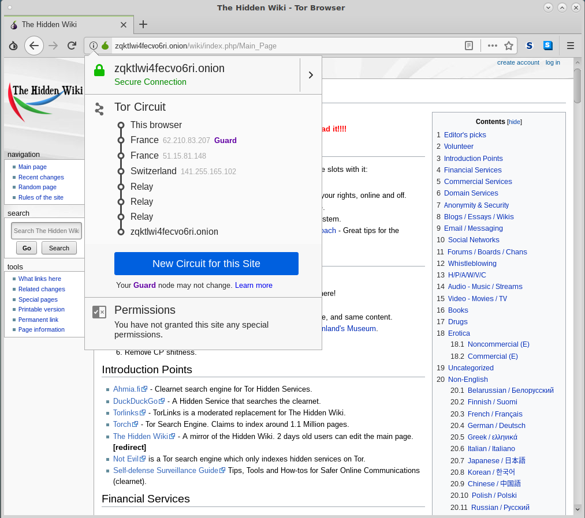

# Aula TP - 25/Fev/2019
## Exercícios

### 1\. TOR (The Onion Router)

#### Pergunta P1.1

#### Pergunta P1.2

1. Clique no lado esquerdo da barra de URL e verifique qual é o circuito para esse site.

Acesso a [http://zqktlwi4fecvo6ri.onion/wiki/index.php/Main_Page]() 

O circuito vai da máquina atual (OP) por dois OR localizados em França e um terceiro na Suiça em 3 saltos para depois ter 3 saltos por _relays_ saindo da rede TOR para a máquina onde o serviço do _website_ acima está. Note-se que o domínio é um domínio `.onion` ou seja, é um endereço de um serviço anónimo. Em baixo, a imagem ilustra o caminho a máquina local até à máquina do serviço.

2. Porque existem 6 "saltos" até ao site Onion, sendo que 3 deles são "*relay*"? Utilize características do protocolo TOR para justificar.

O serviço disponibiliza um par de chaves para disponibilizar o seu serviço e escolhe alguns pontos de introdução que anuncia no Directory Server com a chave privada. De seguida, a máquina cria um circuito TOR para cada um desses pontos de introdução (com 3 saltos e dois OR em cada circuito) ficando estes à espera de pedidos.

O utilizador do serviço usa o TOR Browser para aceder ao serviço anónimo, sendo escolhido um OR para ponto de _rendez-vouz_. O browser estabelece um circuito TOR até esse ponto de _rendez-vous_ guardando um segredo (_cookie rendez-vouz_)  para reconhecimento do serviço anónimo a quem se quer estabelecer. Em seguida, o browser abre um circuito TOR até a um dos pontos de introdução, e fornce-lhe uma mensagem cifrada com o segredo guardado no ponto de _rendez-vous_ e informação sobre o mesmo cifrada com a chave pública do serviço anónimo e inicia o acordo de chaves Diffie-Hellman.

O ponto de introdução reencaminha a mensagem deixada pelo browser neste, para a máquina do serviço anónimo, com a segunda parte do Diffie-Hellman e um _hash_ da chave de sessão que partilha com o browser.

O serviço anónimo conecta-se com o ponto de _rendez-vous_ escolhendo 3 OR e a máquina local outros tantos. Note-se que a máquina local não consegue saber quais são os OR escolhidos pelo serviço nem este os OR escolhidos pela máquina local.

A máquina local envia um _relay begin_ para a máquina do serviço e conecta com o serviço.

Como foi dito acima 3 saltos são da máquina local até ao ponto de _rendez_vouz_ e outros 3 são da máquina remota com o serviço até ao ponto de _rendez-vouz_. Como a não se consegue saber quais os ORs escolhidos pela máquina remota o browser apenas apresenta aqueles conhecidos  pela máquina local.

