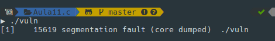
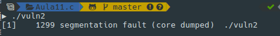

# Aula TP - 29/Abr/2019

## Exercícios

### 1\. _Buffer Overflow_


#### Pergunta P1.1 - Buffer overflow em várias linguagens

Verifique o que ocorre no mesmo programa escrito em Java (LOverflow2.java), Python (LOverflow2.py) e C++ (LOverflow2.cpp), executando-os.

Explique o comportamento dos programas.


#### Pergunta P1.2 - Buffer overflow em várias linguagens

Verifique o que ocorre no mesmo programa escrito em Java (LOverflow3.java), Python (LOverflow3.py) e C++ (LOverflow3.cpp), executando-os.

Explique o comportamento dos programas.


#### Pergunta P1.3 - Buffer overflow

Analise e teste os programs escritos em C RootExploit.c e 0-simple.c .

+ Indique qual a vulnerabilidade de _Buffer Overflow_ existente e o que tem de fazer (e porquê) para a explorar e (i) obter a confirmação de que lhe foram atribuídas permissões de root/admin, sem utilizar a _password_ correta, (ii) obter a mensagem "YOU WIN!!!".


#### Pergunta P1.4 - Read overflow

Analise e teste o program escrito em C ReadOverflow.c .

+ O que pode concluir?


#### Pergunta P1.5

Agora que já tem experiência em efetuar o _overflow_ a um _buffer_ (cf. pergunta P1.3), consegue fazer o mesmo se for necessário um valor exato?

Compile e execute o programa 1-match.c, e obtenha a mensagem de "Congratulations" no ecrã. Notas:
  + já ouviu falar de _little-endian_ e _big-endian_?

Indique os passos que efetuou para explorar esta vulnerabilidade.

---
---

### 2\. Vulnerabilidade de inteiros


#### Pergunta P2.1

Analise o programa overflow.c.

1. Qual a vulnerabilidade que existe na função *vulneravel()* e quais os efeitos da mesma?

A vulnerabilidade existente é a *Heap overflow*. A memória *heap* é uma região da memória RAM alocada pelo programa em execução para armazenar variáveis dinâmicas. No caso da linguagem *C*, essas variáveis são alocadas nesse espaço da memória utilizando as funções `malloc()` e `calloc()`. Uma vez que certa quantidade de memória é alocada para uma variável, esse espaço ficará reservado durante toda a execução do programa, a não ser que o programador libere esse espaço em algum momento.

Como a memória RAM, e consequentemente a região *heap*, é finita, há um limite de memória que o programador pode alocar para as variáveis dinâmicas. Caso não haja esse controle, o programa pode tentar utilizar mais memória do que há disponível e, assim, causar o *heap overflow*. Isso pode permitir o acesso a outras áreas da memória, as quais podem conter instruções para outras execuções (como um código malicioso, por exemplo), ou dados sensíveis que podem ser lidos por um atacante.

No caso da função `vulneravel()`, é precisamente essa falta de controle que ocasiona a vulnerabilidade. Na linha 6, temos:

```c
matriz = (char *) malloc(x*y);
```

Como as variáveis `x` e `y` são recebidas como parâmetro e não há uma validação das mesmas, é possível que o programa tente alocar mais memória do que o disponível.

2. Complete o *main()* de modo a demonstrar essa vulnerabilidade.

```c
int main() {
    char* a;
    vulneravel(a, 1000000, 1000000, 'a')
}
```

3. Ao executar dá algum erro? Qual?

Ao executar o programa, recebemos o erro *Segmentation fault (core dumped)*, o qual representa, justamente, a vulnerabilidade em questão.



#### Pergunta P2.2

Analise o programa underflow.c.

1. Qual a vulnerabilidade que existe na função *vulneravel()* e quais os efeitos da mesma?

A vulnerabilidade existente é o *Buffer Underflow*, definida pelo CWE 124 (<https://cwe.mitre.org/data/definitions/124.html>). Essa falha de segurança ocorre quando o ponteiro tenta referenciar uma localidade da memória anterior ao início do *buffer*. No caso desta função específica, a falha ocorre por falta de validação da variável `tamanho` antes da operação da linha 12:

```c
tamanho_real = tamanho - 1;
```

Se a variáel `tamanho` tiver valor `0`, essa operação causará um erro, uma vez que a variável `tamanho_real` é do tipo `size_t`, a qual aceita apenas inteiros positivos.

Assim como outras vulnerabilidades relacionadas aos limites do espaço de memória, os efeitos dessa falha podem variar desde a corrupção de dados armazenados na memória, até a execução de comandos arbitrários, com a manipulação de ponteiros.

2. Complete o *main()* de modo a demonstrar essa vulnerabilidade.

Para explorar essa vulnerabilidade, o *main()* poderá ser escrito da seguinte forma:

```c
int main() {
	char* a;
    vulneravel(a, 0);
}
```


3. Ao executar dá algum erro? Qual?

Ao executar o programa com o código acima, é gerado um erro de *Segmentation fault*:


