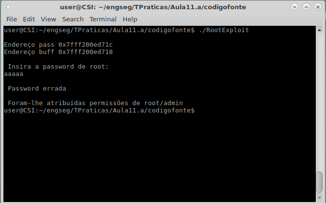
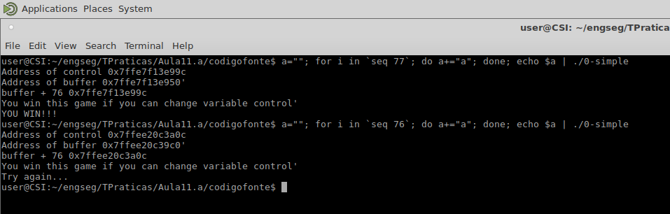
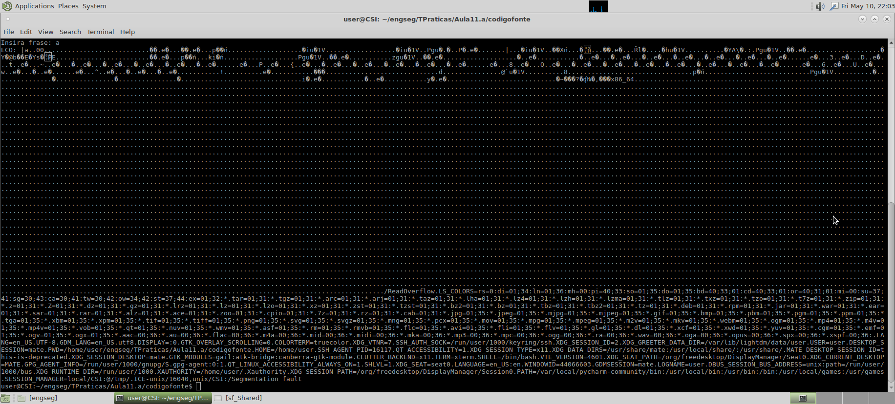
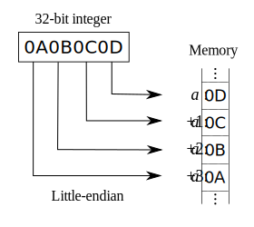
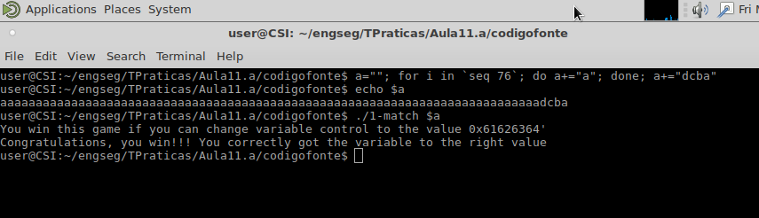

# Aula TP - 29/Abr/2019

## Exercícios

### 1\. _Buffer Overflow_


#### Pergunta P1.1 - Buffer overflow em várias linguagens

Visto todos os programas fazerem a mesma coisa seria de esperar que os resultados fossem todos os mesmo mas, quando se insere um número maior do que o esperado pelo programa todos eles apresentam reações diferentes.

Quando se corre o programa em C++ e fazemos *Overflow* da variável ```tests``` o mesmo irá continuar a pedir para inserir o próximo número mas não deixará colocar qualquer *input* até chegar ao fim da quantidade de números que tínhamos dito que iriamos colocar. Mas quando fazemos com que o mesmo ocorra quando nós pede para inserirmos a quantidade de números que queremos colocar o programa entra em *loop* fazer *print* constante de "Insira numero: ".

Quando se corre o programa em Java e tentamos fazer o mesmo ocorre uma ```InputMismatchException``` e o programa é terminado.

Quando se corre o programa em Python e tentamos fazer *Overflow* ocorre o erro ```OverflowError: range() result has too many items``` mas somente quando o fazemos no *input* de "Quantos numeros?" visto que "Insira numero: " aceita como *input* números muito maiores.


#### Pergunta P1.2 - Buffer overflow em várias linguagens

Quando se corre o programa em C++ se tentarmos fazer o ataque no 1º *input* pedido o mesmo irá fechar a execução fazendo *print* de ```Bus error```. Quando tentamos fazer o mesmo com o *input* "Que valor deseja recuperar?" temos como resultado o *output* de "O valor e 0".

Quando se corre o programa em Java e tentamos fazer o mesmo ocorre uma ```InputMismatchException``` e o programa é terminado.

Quando se corre o programa em Python e tentamos fazer *Overflow* ocorre o erro ```OverflowError: range() result has too many items``` mas somente quando o fazemos no 1º *input* visto que "Que valor deseja recuperar?"  tem como *output* "O valor e" e o erro ```IndexError: cannot fit 'long' into an index-sized integer```.


#### Pergunta P1.3 - Buffer overflow

Analise e teste os programs escritos em C RootExploit.c e 0-simple.c .

##### RootExploit.c

A vulnerabilidade de _overflow_ existente (_Stack Buffer Overflow_) deve-se ao facto do tamanho do _input_ recebido pela função `gets` não verificar o tamanho. Aliás a função `gets` gera alertas do compilador dado tão insegura que é.

Com efeito duas variáveis são declaradas no início: a variável `pass` que é um inteiro (4 bytes em C - usualmente) e um array de caracteres de 4 bytes referente à variável `buff`. Estes valores são colocados na _stack_ do endereço mais alto para o mais baixo, sendo que a escrita é ao contrário (indexação é do mais baixo para o mais alto), isto é, os 4 bytes para a variável inteira são alocados primeiro e os 4 bytes do array são alocados de seguida. De notar que os 4 bytes da variável `pass` são inicializados a 0 e o valor da variável se forem igual a 1 então são atribuídas permissões de root/admin.

Para efetuar o _overflow_ bastam escrever 5 caracteres, sendo que o último tem que ser diferente de `0`. Isto porque em C, qualquer valor diferente de `0` é verdadeiro, assim basta escrever apenas 1 byte na memória alocada para a variável `pass`.





##### 0-Simple.c

Este caso é do mesmo tipo do anterior e funciona da mesma forma: temos duas variáveis (um inteiro `control` de 4 bytes e um array de caracteres - `buffer` - de 64 bytes). A única coisa diferente é que a variável não é inicializada logo na declaração, todavia é-lhe atribuido o valor `0` antes da leitura do buffer. Aqui se o valor da variável for diferente de `0` obtemos a mensagem  "YOU WIN!!!".


Para efetuar o _overflow_ seriam necessários 65 bytes, sendo que o último, uma vez mais diferente de 0, e pelas mesmas razões enunciadas acima. Todavia o compilador pode compilar e efetuar uma série de otimizações com o alinhamento dos _bytes_ ou possívelmente poderá estar a usar _address space randomization_, o que foi o caso porque as duas variáveis não foram alocadas de forma contígua. Todavia, ao analizar-se os endereços de cada variável foi possivel escrever no _buffer_ de tal forma a modificar a variável `control` de forma a obter a mensagem "YOU WIN!!!". Ou seja, foram necessários escrever 77 caracteres para poder explorar o _buffer overflow_. Note-se que, aqui por simplicidade, se modificou o código em C para obter os endereços, no entanto, o mesmo efeito seria conseguido usando o GDB.





#### Pergunta P1.4 - Read overflow

Analise e teste o program escrito em C ReadOverflow.c .

No programa `ReadOverflow` o programa pede ao utiliador o número de caracteres a introduzir, pedindo depois uma frase para introduzir e para cada caractere que não for um caractere de controlo, o programa coloca no _stdout_ os caracteres intruduzidos. Caso for um caractere de controlo, o mesmo coloca do _stdout_ um ponto. O _buffer_ usado para leitura tem um tamanho de 100.

O problema com esta implementação é que se está a pedir ao utilizador um número de caracteres e o programa não coloca o terminador da _string_ (o `\0`). Assim, um utilizador pode introduzir um tamanho maior que o _buffer_ e assim obter informação do sistema. 

Na imagem abaixo está o exemplo da exploração desta vulnerabilidade para um tamanho de 64000 caracteres.




#### Pergunta P1.5

Agora que já tem experiência em efetuar o _overflow_ a um _buffer_ (cf. pergunta P1.3), consegue fazer o mesmo se for necessário um valor exato?

Compile e execute o programa 1-match.c, e obtenha a mensagem de "Congratulations" no ecrã. Notas:
  + já ouviu falar de _little-endian_ e _big-endian_?

Indique os passos que efetuou para explorar esta vulnerabilidade.


Tal como na pergunta 1.3 são necessários 76 bytes para chegar à base do endereço do valor inteiro de `control`. Neste caso temos que colocar um valor exato: `0x61626364` em _little-endian_. Este valor em ASCII representa a _string_ "abcd" para cada par de valor hexadecimal (1byte). Com efeito em _little-endian_ esse valor é escrito ao contrário "dcba" como indica a imagem:




Sabendo a posição de memória, chegou-se rapidamente ao resultado como indica a imagem abaixo:




---

### 2\. Vulnerabilidade de inteiros


#### Pergunta P2.1

Analise o programa overflow.c.

1. Qual a vulnerabilidade que existe na função *vulneravel()* e quais os efeitos da mesma?

A vulnerabilidade existente é a *Heap overflow*. A memória *heap* é uma região da memória RAM alocada pelo programa em execução para armazenar variáveis dinâmicas. No caso da linguagem *C*, essas variáveis são alocadas nesse espaço da memória utilizando as funções `malloc()` e `calloc()`. Uma vez que certa quantidade de memória é alocada para uma variável, esse espaço ficará reservado durante toda a execução do programa, a não ser que o programador libere esse espaço em algum momento.

Como a memória RAM, e consequentemente a região *heap*, é finita, há um limite de memória que o programador pode alocar para as variáveis dinâmicas. Caso não haja esse controle, o programa pode tentar utilizar mais memória do que há disponível e, assim, causar o *heap overflow*. Isso pode permitir o acesso a outras áreas da memória, as quais podem conter instruções para outras execuções (como um código malicioso, por exemplo), ou dados sensíveis que podem ser lidos por um atacante.

No caso da função `vulneravel()`, é precisamente essa falta de controle que ocasiona a vulnerabilidade. Na linha 6, temos:

```c
matriz = (char *) malloc(x*y);
```

Como as variáveis `x` e `y` são recebidas como parâmetro e não há uma validação das mesmas, é possível que o programa tente alocar mais memória do que o disponível.

2. Complete o *main()* de modo a demonstrar essa vulnerabilidade.

```c
int main() {
    char* a;
    vulneravel(a, 1000000, 1000000, 'a')
}
```

3. Ao executar dá algum erro? Qual?

Ao executar o programa, recebemos o erro *Segmentation fault (core dumped)*, o qual representa, justamente, a vulnerabilidade em questão.


#### Pergunta P2.2

Analise o programa underflow.c.

1. Qual a vulnerabilidade que existe na função *vulneravel()* e quais os efeitos da mesma?

A vulnerabilidade existente é o *Buffer Underflow*, definida pelo CWE 124 (<https://cwe.mitre.org/data/definitions/124.html>). Essa falha de segurança ocorre quando o ponteiro tenta referenciar uma localidade da memória anterior ao início do *buffer*. No caso desta função específica, a falha ocorre por falta de validação da variável `tamanho` antes da operação da linha 12:

```c
tamanho_real = tamanho - 1;
```

Se a variáel `tamanho` tiver valor `0`, essa operação causará um erro, uma vez que a variável `tamanho_real` é do tipo `size_t`, a qual aceita apenas inteiros positivos.

Assim como outras vulnerabilidades relacionadas aos limites do espaço de memória, os efeitos dessa falha podem variar desde a corrupção de dados armazenados na memória, até a execução de comandos arbitrários, com a manipulação de ponteiros.

2. Complete o *main()* de modo a demonstrar essa vulnerabilidade.

Para explorar essa vulnerabilidade, o *main()* poderá ser escrito da seguinte forma:

```c
int main() {
	char* a;
    vulneravel(a, 0);
}
```


3. Ao executar dá algum erro? Qual?

Ao executar o programa com o código acima, é gerado um erro de *Segmentation fault*:


