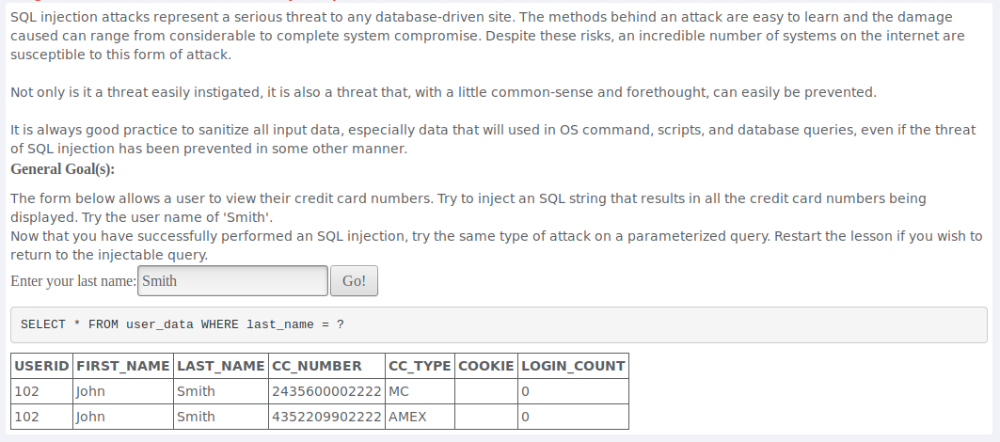
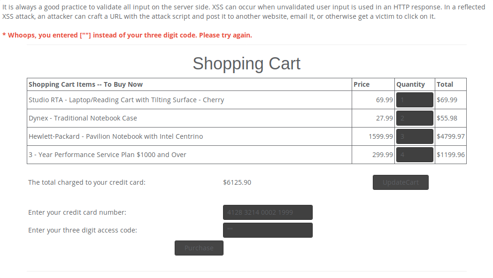

# Aula TP - 06/Mai/2019

## Exercícios

### 1\. _Injection_
#### Pergunta 1.1 - _String SQL Injection_

"SQL Injection" consiste na inserção de código SQL num *input* de modo a conseguir acesso a informação privilegiada sendo utilizado, em certos casos, para fazer *Elevation of Privilege* sendo este ataque possível devido a uma fraca verificação do *input*.

Com a inserção do nome aconselhado ```Smith``` temos o seguinte *output*:



Se colocarmos um *input* que é sempre inerentemente verdadeiro conseguimos ter acesso a toda a informação da base de dados. Neste caso o input escolhido foi ```' OR '1'='1``` visto que a *query* irá colocar a informação recebida entre ```''``` e, deste modo, ficamos com um *input* que será sempre verdade.


#### Pergunta 1.2 - _Numeric SQL Injection_

Com o *input* normal do local, sendo neste exemplo ```Columbia```, temos o seguinte *output*:


Para fazermos o ataque temos de ir ás ferramentas de programador para podermos analisar e editar o HTML. 

Lendo o código inicial verificamos que o valor inserido na *query* do local ```Columbia``` é o ```value = "101"``` conseguindo, assim, editar esse valor de modo a conseguirmos acesso a toda a informação dessa tabela tendo usado o mesmo exemplo que o exercício anterior, ```'' OR '1'='1'```.


#### Pergunta 1.3 - _Database Backdoors_


* Passo 1

Pode-se ver na aplicação a _query_ que está a ser feita.


Com a inserção do código numérico 101, este valor é adicionado à _query_ impressa no ecrã, e o utilizador com o ID 101 aparece numa tabela como demostrado na imagem seguinte.


Para introduzir outra instrução _SQL_ apenas se adicionou uma tautologia, o carateres `;` e em seguida a instrução de `UPDATE` que foi executada com sucesso. Note-se que não era necessário colocar o ID numérico: uma string aleatória seria suficiente com a tautologia. Além do `UPDATE` conseguimos ver as _passwords_, IDs de utilizadores, e outros dados, de todos os utilizadores da base de dados. 


* Passo 2

Para introduzir o _backdoor_ utilizou-se a mesma técnica com sucesso, introduzindo o _trigger_  `CREATE TRIGGER mybackdoor BEFORE INSERT ON employee FOR EACH ROW BEGIN UPDATE SET email='john@hackme.com' WHERE userid = NEW.userid` que introduz um novo utilizador com ID novo. Como a base de dados não suporta _triggers_ o resultado nada foi executado como esperado. A compleção do exercício está na imagem seguinte.


---
### 2\. XSS
#### Pergunta 2.1 - _Reflected XSS_


O _Reflected Cross Site Scripting_ permite executar um _script_  (tipicamente em Javascript) refletido no diretamente no no _browser_ da vítima. Um campo de _input_ pode não ser corretamente validado, permitindo a injeção de _scripts_ no campos, como por exemplo `<script> alert('evil_function') </script>`.

Para procurar os campos de texto que permitiriam este tipo de ataque introduziram-se _inputs_ inesperados, neste caso aspas para verificar se haveria algum tipo de validação. Nos campos de intrução de quantidade, as aspas intrduzidas foram transformadas em pontos e no campo de introdução de cartão de crédito nada aconteceu. 


No campo de introdução dos três dígitos do cartão ocorreu um erro, dando o mote para a injeção do _script_ nesse campo.



Em seguida testou-se a hipótese testando com o _script_ `<script>alert("SSA!!")</script>, que foi confirmada com o alerta, como se pode ver na figura abaixo.


Para verificar que valores e que variáveis estavam a ser utilizadas foi necessário inspecionar o código fonte e verificá-los na _tag_ `form`. O nome das variáveis dos campos são: `QTY1`, `QTY2`, `QTY3` e `QTY4` e podem-se obter tanto os nomes como os valores da seguinte forma: 

```javascript
alert("" + document.form['QTY1'].name + ": " + document.form['QTY1'].value + "\n" +
"" + document.form['QTY2'].name + ": " + document.form['QTY2'].value + "\n" +
"" + document.form['QTY3'].name + ": " + document.form['QTY3'].value + "\n" +
"" + document.form['QTY4'].name + ": " + document.form['QTY4'].value)
```

Em seguida introduziu-se o seguinte _script_ na caixa de texto de introdução dos 3 dígitos do cartão de crédito no formulário:

```html
<script>alert("" + document.form['QTY1'].name + ": " + document.form['QTY1'].value + "\n" +
"" + document.form['QTY2'].name + ": " + document.form['QTY2'].value + "\n" +
"" + document.form['QTY3'].name + ": " + document.form['QTY3'].value + "\n" +
"" + document.form['QTY4'].name + ": " + document.form['QTY4'].value)</script>
```

O resultado foi o seguinte:


Exercício Completo


---
### 3\. Quebra na Autenticação
#### Pergunta 3.1 - _Forgot Password_


Alguns utilizadores que são comuns em aplicações e serviços:

- admin
- root
- anonymous
- guest

Além disso, na página da falha há a seguinte instrução:

> Please input your username. See the OWASP admin if you do not have an account.

Com essas duas informações (os utilizadores comuns, e as instruções do WebGoat), nossa primeira tentativa é com o utilizador "admin". A aplicação reconheceu esse utilizador e fez a pergunta de segurança:


Nessa segunda etapa, percebemos que a aplicação não faz nenhum controle contra *brute-force*. Testamos as seguintes cores:

- black
- white
- blue
- red
- yellow
- green

Nessa última tentativa, a aplicação nos mostrou a senha do utilizador admin:


#### Como evitar esse tipo de ataque

##### 1. Implementar um controle contra Força Bruta

Apesar de não ser a forma ideal de mitigar esse tipo de ataque, esse controle já resolveria parcialmente. O método consiste em bloquear as requisições a partir de uma certa quantidade de erros.

##### 2. Mudar o processo de recuperação de palavra passe

A forma mais segura de implementar um processo de recuperação de palavra passe é utilizando e-mail e um link de acesso único. O processo funciona da seguinte forma:

1. O utilizador envia ao servidor o *username* ou endereço de e-mail.
2. Independente da informação estar certa ou errada, a aplicação apresenta uma mensage genérica. Por exemplo: "Se esse utilizador existir, enviaremos um e-mail para o mesmo com as instruções para a troca da palavra passe."
3. Se o utilizador existir, a aplicação deve enviar um e-mail com um link único (com uma _hash_, por exemplo), e com tempo de expiração
4. O utilizador clica nesse link e é direcionado a uma página em que irá definir uma palavra passe nova.